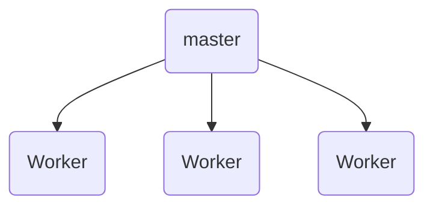

Nginx 由俄罗斯程序员 Igor 开发，目的是解决 [C10K 问题](https://en.wikipedia.org/wiki/C10k_problem)。Nginx 和 Apache HTTP Server 是目前最流行的 Web 服务器。

## 安装

macOS:

```sh
brew install nginx
```

Ubuntu:

```sh
sudo apt install nginx
```

Docker:

```sh
docker pull nginx
```

## 使用

```sh
nginx # 启动 Nginx
open http://127.0.0.1:8080 # 检查是否启动成功
```

Nginx 进程模型：



- master 进程负责读取和验证配置文件，以及管理 worker 进程。
- worker 进程是 Nginx 的工作进程，负责处理实际的请求。

服务启停：

```sh
nginx -s quit   # 优雅停止
nginx -s stop   # 立即停止
nginx -s reload # 重新加载配置文件
nginx -s reopen # 重新打开配置文件
```

### 静态站点部署

首先找到配置文件位置：

```sh
$ nginx -t
nginx: the configuration file /opt/homebrew/etc/nginx/nginx.conf syntax is ok
nginx: configuration file /opt/homebrew/etc/nginx/nginx.conf test is successful
```

编辑配置文件 `/opt/homebrew/etc/nginx/nginx.conf`：

```nginx
http {
    include       mime.types;
    default_type  application/octet-stream;
    sendfile        on;
    keepalive_timeout  65;

    server {
        listen       8080; # 监听端口
        server_name  localhost;

        location / {                     # 匹配根目录
            root   html;                 # 匹配的文件夹（在 Nginx 安装目录下）
            index  index.html index.htm; # 默认页面
        }

        error_page   500 502 503 504  /50x.html;

        location = /50x.html {
            root   html;
        }
    }

    include servers/*;
}
```

参考：[【GeekHour】30 分钟 Nginx 入门教程 | 哔哩哔哩]( https://b23.tv/iS18kps)
