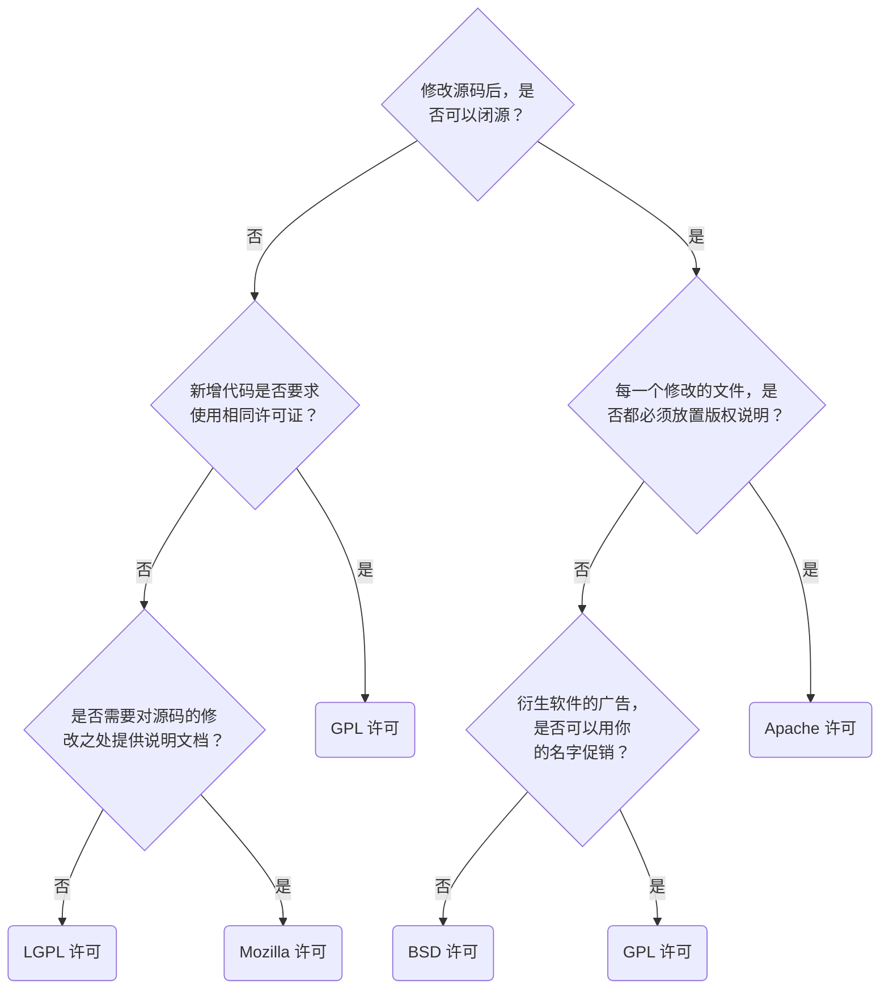

## GPL

GNU 通用公共许可证（GNU General Public License, GPL）

你只要用了我的软件/代码，就也要遵循 GPL。

GPL 对于推动自由软件和开源软件的发展起到了重要作用。

[GNU 通用公共许可证 | 维基百科](https://zh.wikipedia.org/zh-cn/GNU%E9%80%9A%E7%94%A8%E5%85%AC%E5%85%B1%E8%AE%B8%E5%8F%AF%E8%AF%81)

## LGPL

GNU 宽通用公共许可证（Lesser General Public License, LGPL）

如果你用了我的代码，那你就要使用 LGPL。如果你只是调用了我的软件，那则无所谓。

> 除了商业授权，目前 Qt 的开源授权有两种，一种是 GPL 授权，另一种是 LGPL 授权（诺基亚收购后新增）。 对这两种开源授权，简单来说，使用 GPL 版本的软件一定还是 GPL 的开源软件， 无论是使用了 Qt 的程序代码还是修改了 Qt 库代码，都必须按照 GPL 来发布，这是 GPL 的传染性。 GPL 是什么都要开源，这对商业软件应用是不利的，所以诺基亚增加了 LGPL 授权 （第一个 L 可以叫 Lesser 宽松版或 Library 开发库版）。 使用 LGPL 授权就可以利用 Qt 官方动态链接库，而不必开放商业代码。只要不修改和定制 Qt 库， 仅使用 Qt 官方发布的动态链接库就可以不开源，这是商业友好的授权模式。 其实只要不是做商业，就不太需要关注用什么授权，以 GPL 授权发布程序代码就可以了。

[GNU 宽通用公共许可证 | 维基百科](https://zh.wikipedia.org/zh-cn/GNU%E5%AE%BD%E9%80%9A%E7%94%A8%E5%85%AC%E5%85%B1%E8%AE%B8%E5%8F%AF%E8%AF%81)

## MIT

[MIT 许可证 | 维基百科](https://zh.wikipedia.org/zh-cn/MIT%E8%A8%B1%E5%8F%AF%E8%AD%89)

## BSD

[BSD 许可证 | 维基百科](https://zh.wikipedia.org/zh-cn/BSD%E8%AE%B8%E5%8F%AF%E8%AF%81)

## 如何选择许可证

参考文献：

[如何选择开源许可证？| 阮一峰的网络日志](https://www.ruanyifeng.com/blog/2011/05/how_to_choose_free_software_licenses.html)

## 相关概念

### [Copyleft](https://zh.wikipedia.org/wiki/Copyleft)

著佐权，与著作权（Copyright）相对，著佐权并不限制著作内容传播，但是要求被许可者使用同样许可方式来发布派生作品。