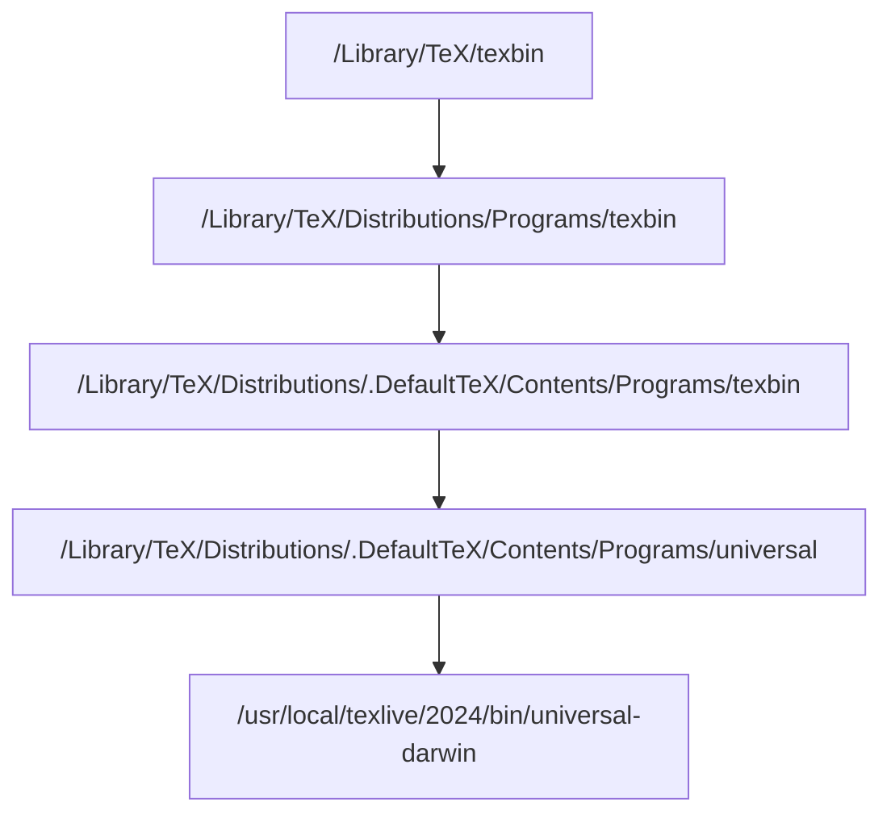

某次我注意到如下软链接：

```sh
$ ls -l
lrwxrwxrwx 1 root    41 Mar 16 16:20 tlmgr -> ../../texmf-dist/scripts/texlive/tlmgr.pl
$ pwd
/Library/TeX/texbin
```

我非常奇怪，因为当前目录是 `/Library/TeX/texbin`，而 `tlmgr` 的软链接指向 `../../texmf-dist/scripts/texlive/tlmgr.pl`，也就是说它应该指向 `/Library/texmf-dist/scripts/texlive/tlmgr.pl`，但是 `Library` 目录中并没有 `texmf-dist` 这个文件夹。

我尝试运行如下命令：

```sh
$ pwd
/Library/TeX/texbin
$ cd ../../texmf-dist
$ pwd
/usr/local/texlive/2024/texmf-dist
```

发现竟然直接跳到了另一个目录。然而如果我分开跳转：

```sh
$ pwd
/Library/TeX/texbin
$ cd ../..
$ cd texmf-dist
cd: no such file or directory: texmf-dist
```

我百思不得姐。问了 ChatGPT，ChatGPT 说是因为我当前在的这个 `texbin` 目录本身就是一个软链接，指向另一个目录。`cd ../../texmf-dist` 相当于直接在另一个目录中跳转。而 `cd ../.. && cd texmf-dist` 则是退出了软链接之后再进行跳转，因此跳转失败。

经过查询，我发现 `texbin` 确实是一个软链接：

```sh
$ ls -l
lrwxr-xr-x 1 root  29 May 13 12:00 texbin -> Distributions/Programs/texbin
```

可是 `tlmgr` 的软链接指向的是 `../../texmf-dist/scripts/texlive/tlmgr.pl`，从 `Distributions/Programs/texbin` 目录依然无法跳转到 `texmf-dist` 目录。

于是我又查了一下 `Distributions/Programs/texbin` 目录，发现它也是一个软链接：

```sh
$ ls -l Distributions/Programs/texbin
lrwxr-xr-x 1 root 39 May 13 12:00 Distributions/Programs/texbin -> ../.DefaultTeX/Contents/Programs/texbin
```

我继续往下查：

```sh
$ ls -l Distributions/Programs/../.DefaultTeX/Contents/Programs/texbin
lrwxr-xr-x 1 root 9 May 13 12:00 Distributions/Programs/../.DefaultTeX/Contents/Programs/texbin -> universal
$ ls -l Distributions/Programs/../.DefaultTeX/Contents/Programs/universal
lrwxr-xr-x 1 root 64 May 13 12:00 Distributions/Programs/../.DefaultTeX/Contents/Programs/universal -> ../../../../../../../usr/local/texlive/2024/bin/universal-darwin
ls -ld Distributions/Programs/../.DefaultTeX/Contents/Programs/../../../../../../../usr/local/texlive/2024/bin/universal-darwin
drwxr-xr-x 495 root 15840 Mar 16 16:21 Distributions/Programs/../.DefaultTeX/Contents/Programs/../../../../../../../usr/local/texlive/2024/bin/universal-darwin
```

这下终于找到真身了。有点乱，整理一下：



`/usr/local/texlive/2024/bin/universal-darwin` 就是我们最终进入的目录。

而其中的 `tlmgr` 指向的 `../../texmf-dist/scripts/texlive/tlmgr.pl`，我们也可以正常找到它的位置，位于 `/usr/local/texlive/2024/texmf-dist/scripts/texlive/tlmgr.pl`，这符合我们的预期。

虽然进入 `/Library/TeX/texbin` 目录就相当于进入 `/usr/local/texlive/2024/bin/universal-darwin` 目录，然而当我们使用 `pwd` 打印当前工作目录时，Shell 并不会告诉我们这一点。Shell 会让我们以为我们就处于 `/Library/TeX/texbin` 目录（毕竟你进入 `..` 目录的话还要退出软链接不是）。